# OS 实验指南 -- Python版

1. [服务进程调度](#ch2)

   * [先来先服务](#ch2-lab1-fcfs)

   * [优先级调度](#ch2-lab1-ps)

   * [时间片轮转调度](#ch2-lab1-rr)

2. [死锁](#sisuo)
   * [银行家算法](#bank)

3. [作业调度](#zuoye)
   * [先来先服务](#zuoye-fcfs)

4. [存储管理](#ccgl)

   * [固定分区算法](#ccgl1)

   * [可变分区算法](#ccgl2)

   * [磁盘移臂调度算法](#ccgl3)

   * [页面置换算法](#ccgl4)

   * [分页、分段存储管理算法](#ccgl5)

5. [磁盘管理](#cpgl)
   * [位示图算法](#bitmap)
6. [注意事项](#notice)

## <span id="ch2">1. 服务进程调度</span>

#### <span id="ch2-lab1-fcfs">1. 先来先服务</span>

​		本实验是模拟进程调度中的先来先服务算法，每次CPU都是按照进入就绪队列的先后次序依次选中一个进程装入CPU运行，等结束时再选取下一个。

​		类成员变量：

```python
self.id = id			# 编号
self.name = name		# 进程名
self.arrive = arrive	# 到达就绪队列时间
self.zx = zx			# 执行时间
self.start = None		# 开始时间
self.finish = None		# 完成时间
self.zz = None			# 周转时间 = 完成时间 - 到达时间
self.zzxs = None		# 带权周转系数 = 周转时间 / 执行时间
```

​		函数包括：

* `queue.buildQue()`：构建队列
* `queue.output()`：打印函数
* `fcfs()`：先来先服务算法

		程序流程图：

```flow
st=>start: 开始
e=>end: 结束
inputID=>operation: 输入进程ID
judgeID=>condition: ID == -1
op1=>operation: 新建一个进程对象，并输
入其信息对其进行初始化
op2=>operation: 将进程对象按照到达时间按序插入就绪队列
fcfsop1=>operation: now = 就绪队列头
fcfsop2=>operation: 计算进程相关信息
fcfsop3=>operation: now = now->next
fcfsjudge1=>condition: now == NULL
output=>operation: 输出信息
st->inputID->judgeID
judgeID(yes)(left)->fcfsop1->fcfsjudge1
judgeID(no)->op1(bottom)->op2(right)->inputID
fcfsjudge1(yes)->output->e
fcfsjudge1(no)->fcfsop2(right)->fcfsop3(top)->fcfsjudge1
```

​		实验结果：

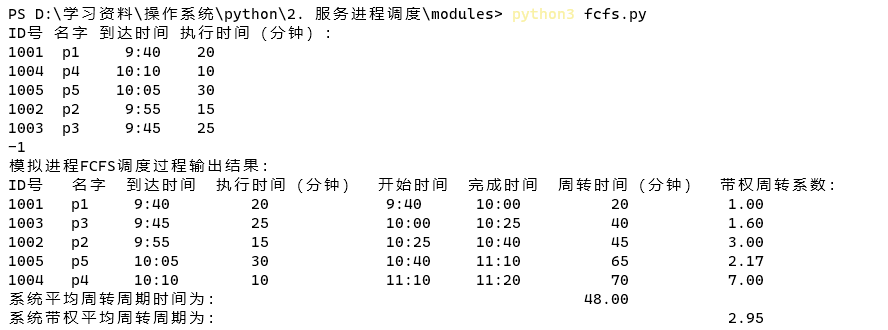

---

#### <span id="ch2-lab1-ps">2. 优先级调度</span>

​		本实验是模拟进程调度中的优先级调度算法，CPU先看当前有哪些进程进入了就绪队列，再从其中选去优先级最高的一个进程装入CPU运行，等结束之后重复上述过程。

​		类成员变量：

```python
self.id = id			# 编号
self.name = name		# 进程名
self.good = good		# 优先级
self.arrive = arrive	# 到达就绪队列时间
self.zx = zx			# 执行时间
self.start = None		# 开始时间
self.finish = None		# 完成时间
self.zz = None			# 周转时间 = 完成时间 - 到达时间
self.zzxs = None		# 带权周转系数 = 周转时间 / 执行时间
```

​		函数包括：

* `queue.buildQue()`：构建队列

* `queue.output()`：打印函数

* `ps()`：优先级调度算法

  程序流程图：

```flow
st=>start: 开始
e=>end: 结束
inputID=>operation: 输入进程ID
judgeID=>condition: ID == -1
op1=>operation: 新建一个进程对象，并输
入其信息对其进行初始化
op2=>operation: 将进程对象按照到达时间按序插入就绪队列
psop00=>operation: 就绪队列头出队列
进入结果队列
psop0=>operation: 计算就绪队列第一
个进程的相关信息
psop1=>operation: now = 就绪队列头
psop2=>operation: 找出在结果队列队尾元素执行完毕时间之前
到达就绪队列的进程，并取出其中优先级最高的进程进行计算
psop3=>operation: now = now->next
psop4=>operation: 将该进程出就绪队列
入结果队列
psjudge1=>condition: now == NULL
output=>operation: 输出信息
st->inputID->judgeID
judgeID(yes)->psop0->psop00->psop1->psjudge1
judgeID(no)->op1(bottom)->op2(right)->inputID
psjudge1(yes)->output->e
psjudge1(no)->psop2(right)->psop4(bottom)->psop3(right)->psjudge1
```

​		实验结果：

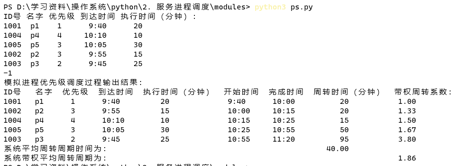

---

#### <span id="ch2-lab1-rr">3. 时间片轮转调度</span>

​		本实验是模拟进程调度中的时间片轮转算法，首先对所有进程按到达时间排好序，然后逐个对就绪队列中的进程轮流进入CPU执行，每次开始的时间就是上个进程让出CPU的时间，在该进程本轮结束前(含结束时间)，所有入队的进程均按时间先后入队，结束时间到再将该进程排到队列的末尾，从而进入后续循环。

​		类成员变量：

```python
self.id = id			# 编号
self.name = name		# 进程名
self.arrive = arrive	# 到达就绪队列时间
self.zx = zx			# 执行时间
self.start = None		# 开始时间
self.finish = None		# 完成时间
self.zz = None			# 周转时间 = 完成时间 - 到达时间
self.zzxs = None		# 带权周转系数 = 周转时间 / 执行时间
self.nowstart = None	# 当前开始时间
self.donetime = 0		# 已完成时间
self.retime = zx		# 剩余完成时间
```

​		函数包括：

* `queue.buildQue()`：构建队列

* `queue.output()`：打印函数

* `rr()`：时间片轮转调度算法

​		程序流程图：

```flow
st=>start: 开始
e=>end: 结束
op0=>operation: 输入进程数 num
op00=>operation: 输入单个时间片的时间
op000=>operation: i = 0
op01=>operation: i += 1
inputID=>operation: 输入进程信息
judgeID=>condition: i < num
op1=>operation: 新建一个进程对象，并输
入其信息对其进行初始化
op2=>operation: 将进程对象按照到达时间按序插入输入队列
rrop0=>operation: 输入队列头出队列、入就绪队列
rrop1=>operation: now = 就绪队列头
rrop2=>operation: 进行一次时间片轮转，计算相关信息
rrop21=>operation: 对输入队列进行遍历，寻找到达的队列，
将其入就绪队列
rrop22=>operation: 输出该轮运行信息
rrop3=>operation: now = now->next
rrop4=>operation: 将执行完毕的进程
从就绪队列删除
rrjudge1=>condition: now == NULL
output=>operation: 输出信息
st->op0->op00->op000->inputID->op01->op1(bottom)->op2(right)->judgeID
judgeID(yes)->rrop0->rrop1->rrjudge1
judgeID(no)->inputID
rrjudge1(yes)->output->e
rrjudge1(no)->rrop2(bottom)->rrop21(bottom)->rrop22(right)->rrop4(bottom)->rrop3(right)->rrjudge1
```

​	实验结果：

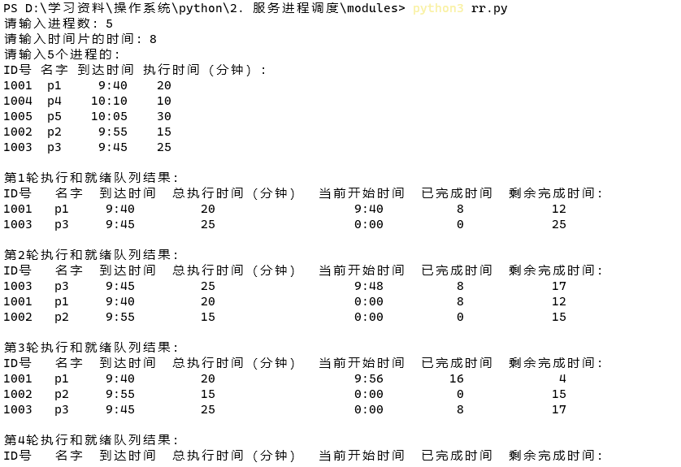

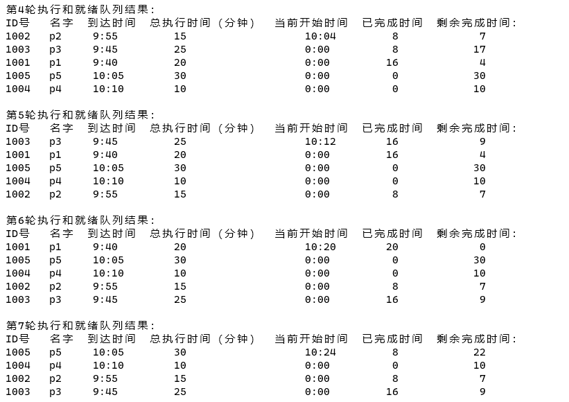

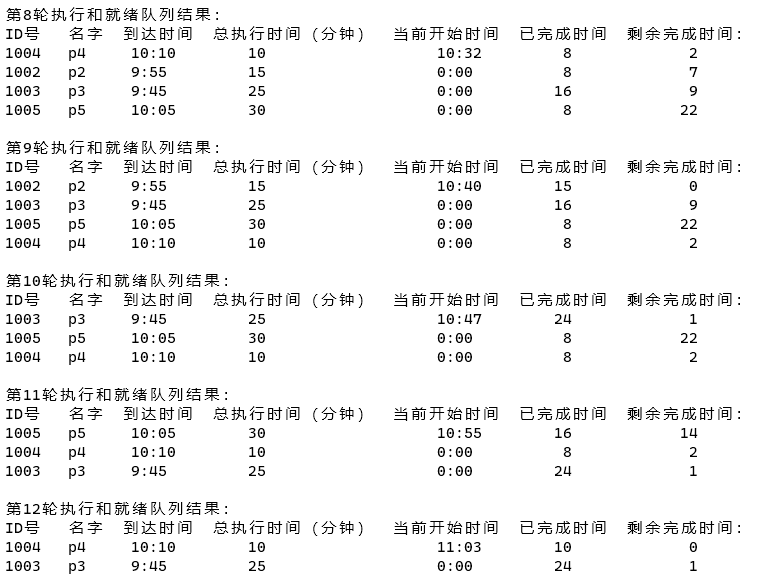

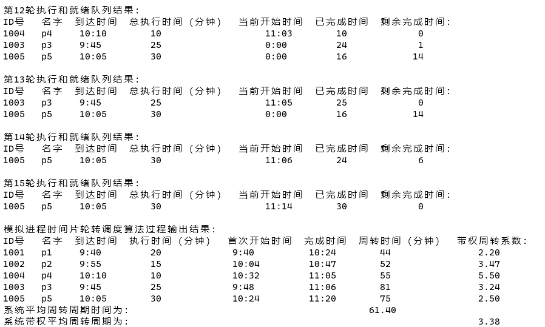

---

## <span id="sisuo">2. 死锁</span>

#### <span id="bank">1. 银行家算法</span>

​		本实验首先判断每个进程对资源的最大需求量，若超出系统初始化的资源数则拒绝分配；然后逐次对每个进程的当前申请量进行判断：若申请量超过尚需求量则拒绝分配；若申请量超过系统可用资源数则推迟分配；否则进行安全性检查，即判断系统剩余资源数是否能确保系统产生一个安全执行序列，能则真正分配，否则推迟分配。

​		类成员变量：

```python
self.sourceTypeNum = None	# 资源种类
self.processNum = None		# 进程数
self.available = []			# 可用资源
self.max = []				# 资源最大量
self.allocation = []		# 已分配资源
self.need = []				# 尚需求量
self.flag = []				# 标识进程是否执行完毕
```

​		函数包括：

* `OS.build()`：入口处理函数

* `OS.output()`：数据输出

* `OS.security()`：安全性算法

* `OS.more()`：继续申请资源

  程序流程图：

  ```flow
  st=>start: 开始
  e=>end: 结束
  op0=>operation: 输入资源种类、进程数、资源数、进程等基本信息
  op1=>operation: 输入进程第一次所需资源
  op2=>operation: 进行资源分配
  op21=>operation: 回滚
  op22=>operation: 回滚
  op3=>operation: 进行资源分配
  co22=>condition: 是否还需要申请资源
  co1=>condition: 循环进行安全性检查算法
  co2=>condition: 安全性检查算法
  st->op0->op1->op2->co1(yes)->co22(yes)->op3->co2(yes)->co22
  co1(no)->op21(top)->op2
  co22(no)->e
  co2(no)->op22
  ```

  实验结果：

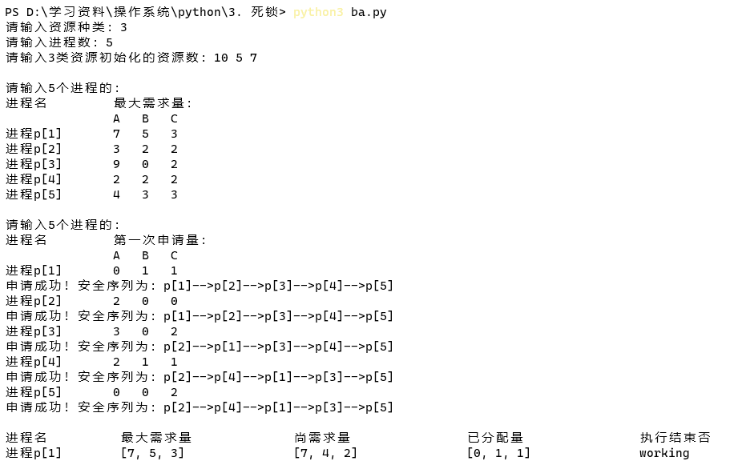

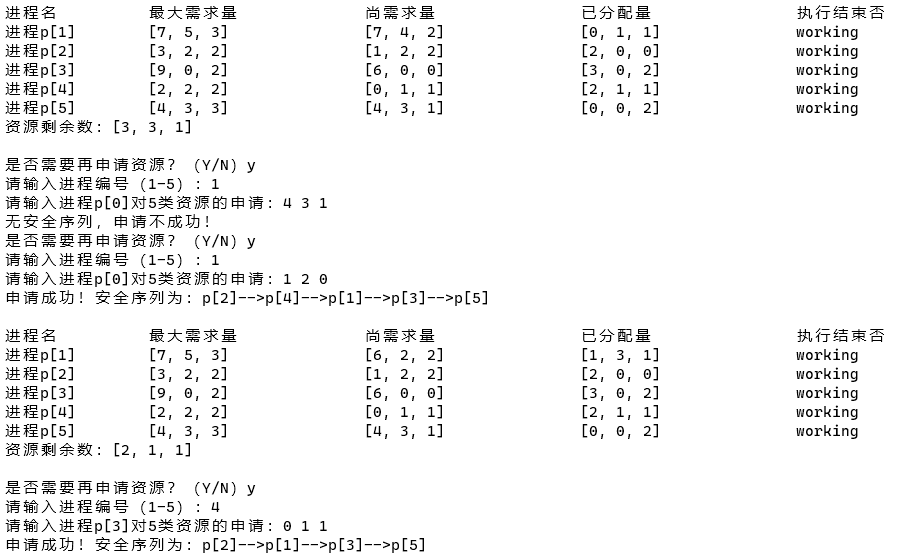

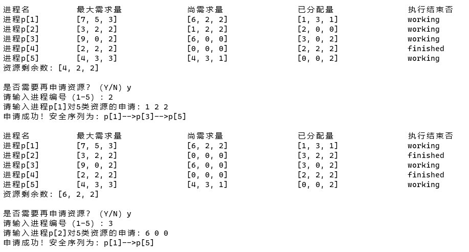

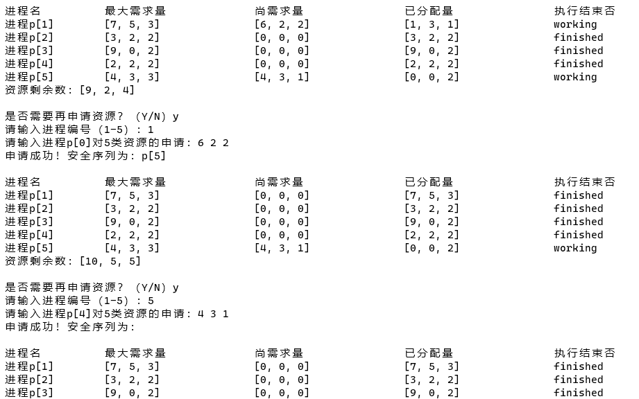

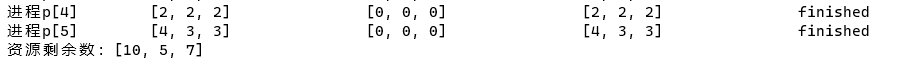

---

## <span id="zuoye">3. 作业调度</span>

#### <span id="zuoye-fcfs">1. 先来先服务</span>

​		本实验在算法上与进程FCFS调度算法类似，细节参考进程FCFS调度算法即可。

​		类成员变量：

```python
self.name = name		# 作业名
self.arrive = arrive	# 作业到达时间
self.zx = zx			# 作业执行时间
self.start = None		# 作业开始时间
self.finish = None		# 作业完成时间
self.zz = None			# 作业周转时间
self.zzxs = None		# 作业带权周转系数
self.wait = None		# 作业调度等待时间
```

​		函数包括：

* `queue.buildQue()`：插入数据、新建队列

* `queue.output()`：队列输出

* `fcfs()`：先来先服务算法

  程序流程图：

```flow
st=>start: 开始
e=>end: 结束
op0=>operation: 输入作业数据并对作业按照到达时间排序插入队列
op1=>operation: 先来先服务算法
st->op0->op1->e
```

​		实验结果：

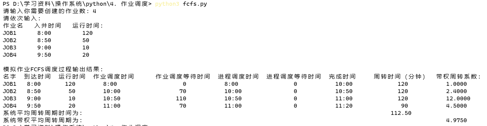

---

## <span id="ccgl">4. 存储管理</span>

#### <span id="ccgl1">1. 固定分区算法</span>

​		本实验模拟存储管理实验中的固定分区算法，算法思想是预先将内存空间划分成若干个空闲分区，分配过程根据用户需求将某一个满足条件的分区直接分配（不进行分割），作业完成后回收对应内存，整个分配过程分区大小和个数不发生变化。

​		类成员变量：

```python
self.num = None			# 分区块数
self.blocks = []		# 分区
self.worknum = None		# 作业个数
self.worksize = []		# 作业大小
```

​		函数包括：

* `Storage.build()`：程序入口

* `Storage.output()`：输出信息

* `Storage.more()`：是否还需要回收

  程序流程图：

  ```flow
  st=>start: 开始
  e=>end: 结束
  op0=>operation: 输入分区、作业等基本信息
  op1=>operation: 遍历可用分区列表装入作业
  op2=>operation: 输出作业信息
  op3=>operation: 输入所需回收作业名并进行回收
  co1=>condition: 是否需要回收
  st->op0->op1->op2->co1(no)->e
  co1(yes)->op3->co1
  ```

  实验结果：

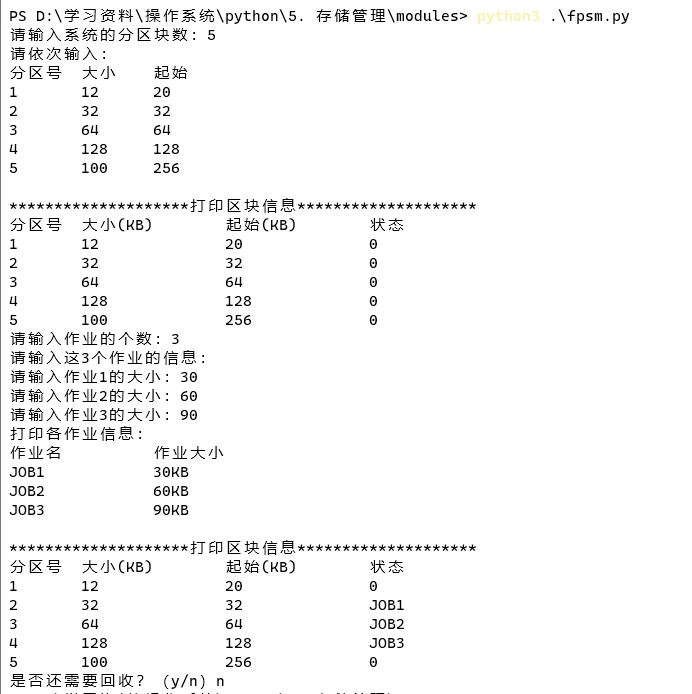

---

#### <span id="ccgl2">2. 可变分区算法</span>

​		本实验模拟存储管理实验中的可变分区算法，该算法主要思想是系统并不预先划分内存区间，而是在作业装入时根据作业的实际需要动态地划分内存空间。若无空闲的存储空间或无足够大的空闲存储空间供分配时，则令该作业等待。

​		类成员变量：

```python
self.size = None		# 内存大小
self.start = None		# 起始地址
self.use = []			# 已用分区
self.free = []			# 空闲分区
```

​		函数包括：

* `Strorge.build()`：程序入口

* `Strorge.output()`：输出信息

* `Strorge.check()`：检查是否存在相连分区

  程序流程图：

```flow
st=>start: 开始
e=>end: 结束
op0=>operation: 输入内存大小、起始地址等基本信息
op1=>operation: 选择内存分配算法
op2=>operation: 输入作业信息并为其分配内存、处理内存表
op3=>operation: 输入想要去配的作业信息
op4=>operation: 进行作业去配、并进行check
co1=>condition: 内存分配yes
内存去配no
st->op0->co1(yes)->op1->op2(left)->co1
co1(no)->op3->op4(right)->co1
```

​		实验结果：

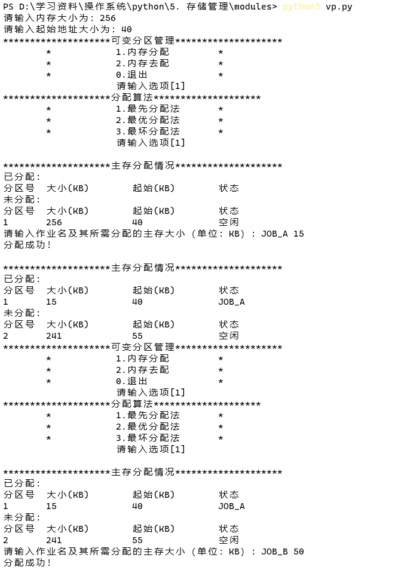

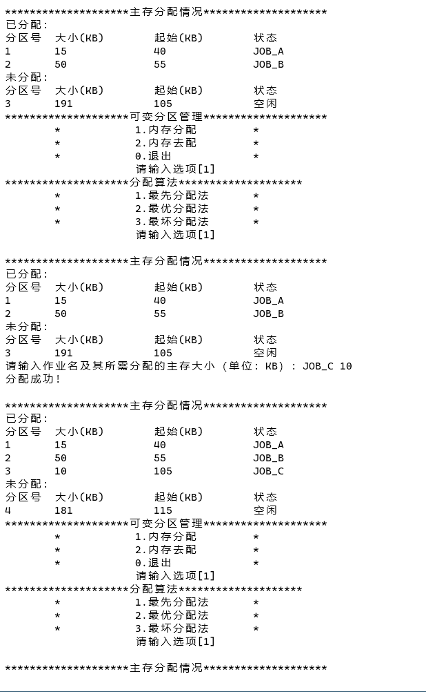

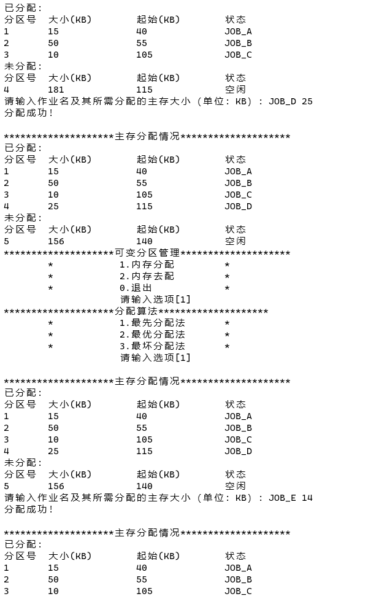

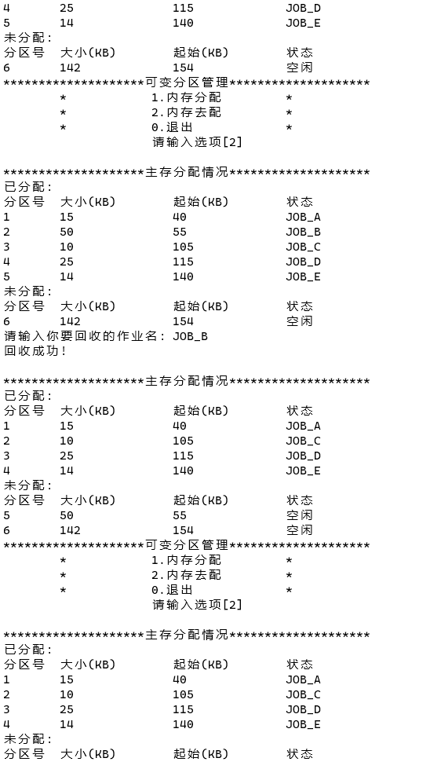

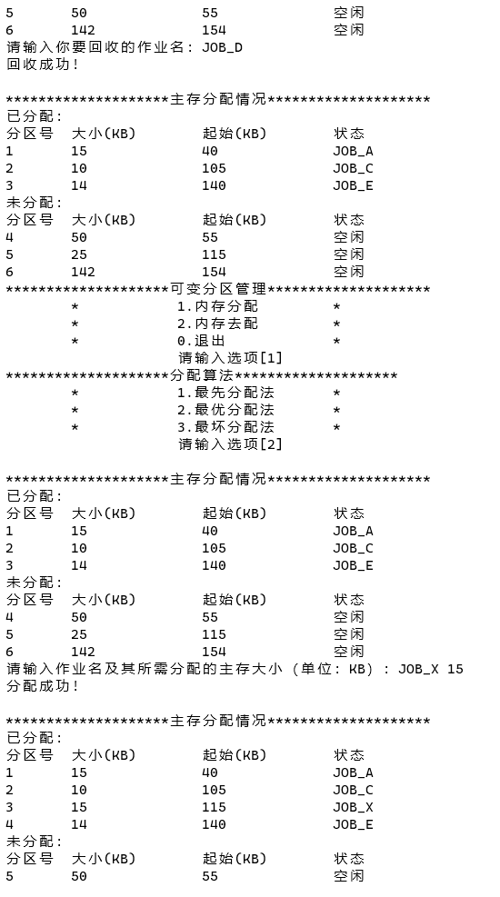

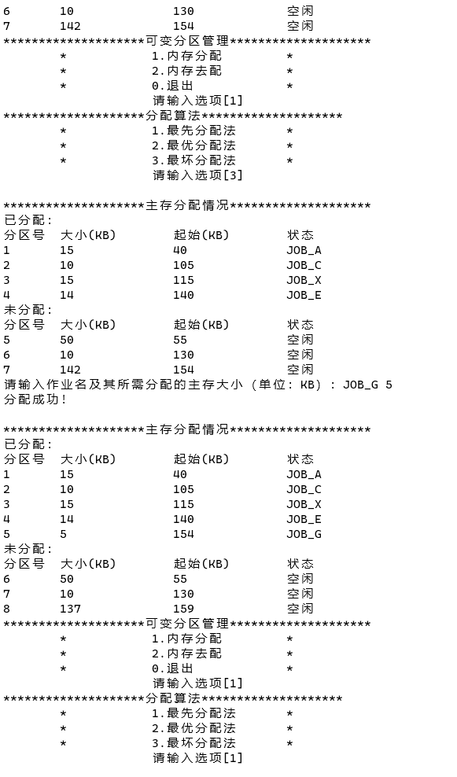

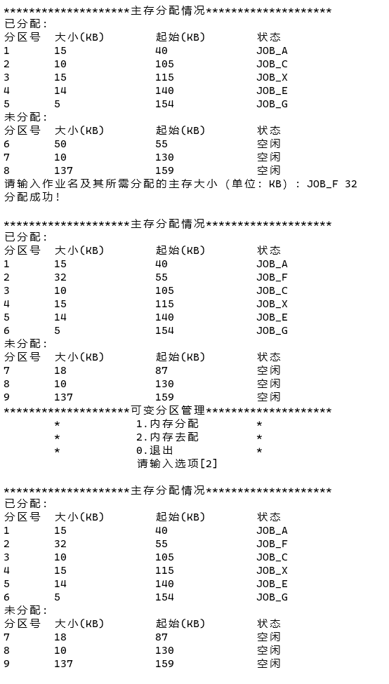

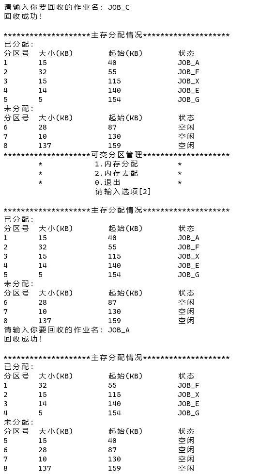

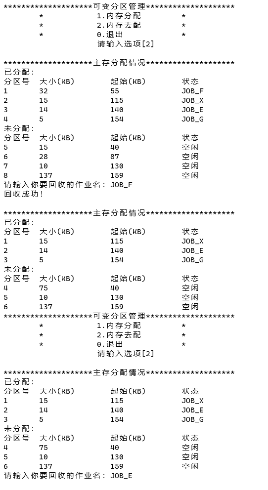


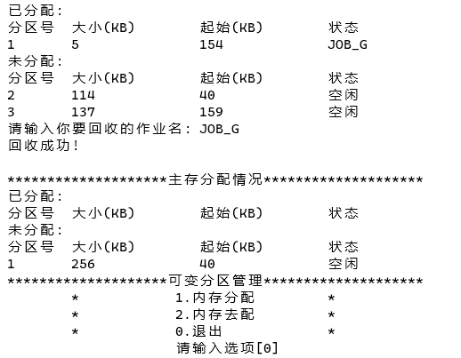

---

#### <span id="ccgl3">3. 磁盘移臂调度算法</span>

​		本实验模拟磁盘移臂调度算法中的FCFS、SSTF和电梯调度算法，FCFS算法的主要思想是根据访问请求的先后次序选择先提出访问请求的为之服务，SSTF算法的主要思想是以磁头移动距离的大小作为优先的因素，从当前磁头位置出发，选择离磁头最近的磁道为其服务，电梯调度算法的主要思想是选请求队列中沿磁头臂前进方向最接近于磁头所在柱面的访问请求作为下一个服务对象。

​		类成员变量：

```python
self.size = None		# 访问序列长度
self.list = []			# 柱面顺序
self.now = None			# 正则访问的页面
```

​		函数包括：

* `Storage.build()`：输入基本信息

* `Storage.fcfs()`：FCFS算法

* `Storage.sstf()`：SSTF算法

* `Storage.elevator()`：电梯调度算法

  程序流程图：

```flow
st=>start: 开始
e=>end: 结束
op0=>operation: 输入访问序列、柱面顺序、正在访问的页面等基本信息
op1=>operation: 选择移臂调度算法
op2=>operation: 按照对应的移臂调度算法去处理进行调度
op3=>operation: 输入结果
st->op0->op1->op2->op3->e
```

​		实验结果：

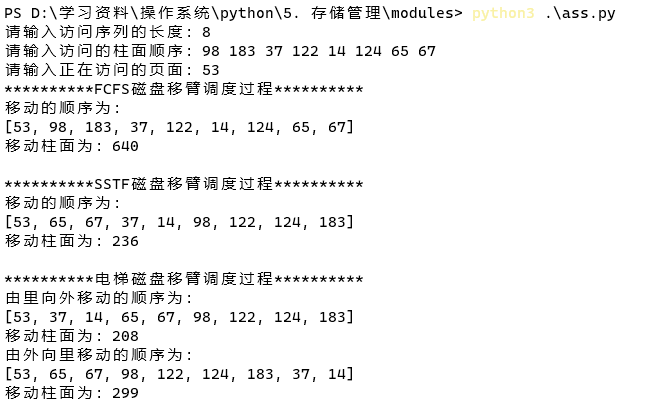

---

#### <span id="ccgl4">4. 页面置换算法</span>

​		本实验模拟的是页面置换算法，页面置换算法指的是当发生缺页中断时，如果操作系统内存中没有空闲页面，则操作系统必须在内存选择一个页面将其移出内存，以便为即将调入的页面让出空间，而用来选择淘汰哪一页的规则的算法。

​		类成员变量：

```python
self.block = None		# 物理块块数
self.job = None			# 作业名
self.len = None			# 作业页面长度
self.list = []			# 作业页面顺序
```

​		函数包括：

* `Storage.build()`：输入物理块块数

* `Storage.input()`：输入作业名、页面长度、页面顺序等信息

* `Storage.out()`：输出运行结果

* `Storage.fifo()`：FIFO调度

* `Storagelru()`：LRU调度

  程序流程图：

```flow
st=>start: 开始
e=>end: 结束
op0=>operation: 输入物理块信息
op1=>operation: 输入作业名、页面长度、页面顺序等信息
op2=>operation: 选择调度方式
op3=>operation: FIFO调度
op4=>operation: LRU调度
op5=>operation: 输出结果
co1=>condition: FIFO调度yes
LRU调度no
st->op0->op1->op2->co1(yes)->op3->op5->e
co1(no)->op4->op5->e
```

​		实验结果：

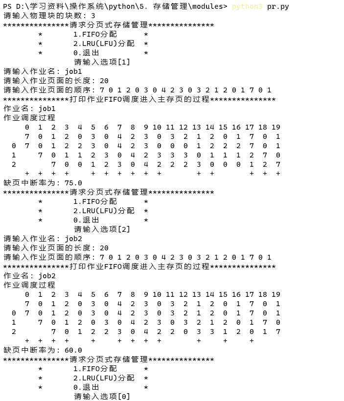

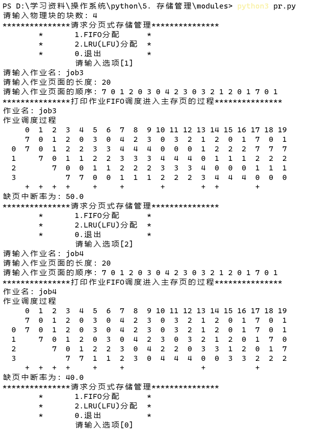

---

#### <span id="ccgl5">5. 分页、分段存储管理算法</span>

​		本实验模拟存储管理中的分页、分段存储管理算法，分页存储管理算法的主要思想是内存被划分成大小固定相等的块，且块相对比较小，每个进程装入时被分成同样大小的页一页装入一帧，整个进程被离散装入到多个不连续的帧，分段存储管理的主要思想是把自己的作业按照逻辑关系划分为若干个段，一个进程的地址空间可以包含几个不同的段。

​		类成员变量：

```python
# 段式
self.size = None			# 内存大小
self.start = None			# 起始地址大小
self.use = []				# 已分配内存
self.free					# 空闲内存
# 分页式
self.size = None			# 内存大小	
self.wordlen = None			# 字长
self.blocklen = None		# 块长
self.a = []					# 初始块信息
self.jobname = []			# 作业名
self.job = []				# 已装入作业
```

​		函数包括：

* `Segment.main()`：分段存储管理算法入口

* `Segment.output()`：分段存储管理算法输出信息

* `Segment.check()`：分段存储管理回收check函数

* `Node.out()`：输出作业在辅存中的信息

* `Page.out()`：分页式算法输出信息

* `Page.distribute()`：分页式算法分配空间

* `Page.recyle()`：分页式算法回收作业

* `Page.main()`：分页式算法入口

  程序流程图：

```flow
st=>start: 开始
e=>end: 结束
op0=>operation: 空间分配
op1=>operation: 空间去配
op2=>operation: check算法
op3=>operation: 内存去配
op4=>operation: 选择对应内存分配算法并进行分配
op5=>operation: 输出结果
op6=>operation: 输出结果
op7=>operation: 输出结果
op8=>operation: 输出结果
co1=>condition: 算法选择
分页式算法yes
分段式算法no
co2=>condition: 空间分配yes去配no
co3=>condition: 空间分配yes去配no
st->co1(yes)->co2(yes)->op0->op7(left)->co2
co2(no)->op1->op8(right)->co2
co1(no)->co3(yes)->op4->op6->co3
co3(no)->op3->op2->op5(right)->co3
```

​		实验结果：

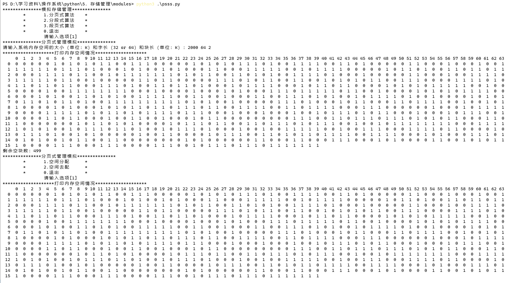

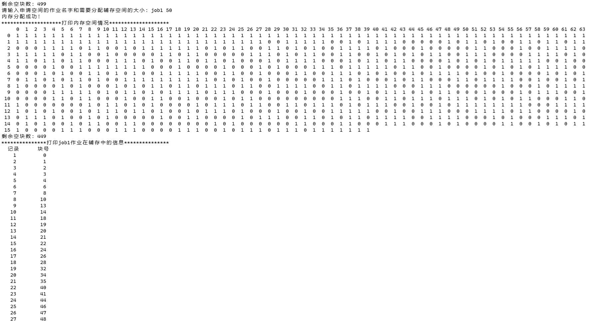

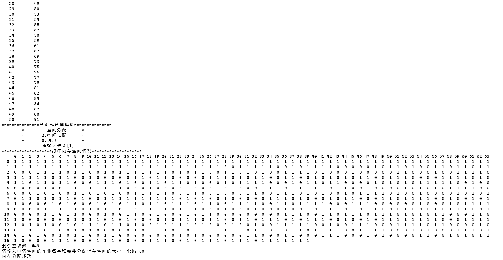

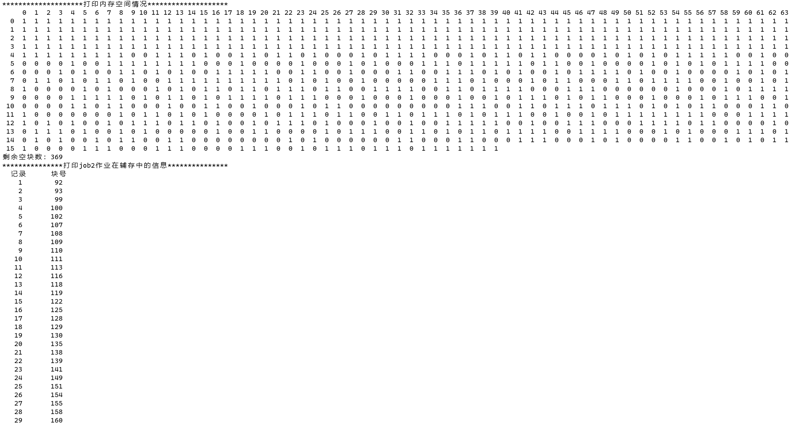


---

## <span id="cpgl">5. 磁盘管理</span>

#### <span id="bitmap">1. 位示图算法</span>

​		本实验模拟的是磁盘管理中辅存空间位示图算法的实现过程，包括内存分配以及内存去配的模拟。

​		类成员变量：

```python
# Node
self.name = name			# 作业名
self.size = size			# 作业大小
self.a = []         		# 块号
self.zihao = []     		# 字号
self.weihao = []    		# 位号
self.zhu = []       		# 柱面号
self.citou = []     		# 磁头号
self.shanqu = []    		# 扇区号
# Disk
self.size = size			# 磁盘大小
self.wordlength = wordlen	# 字长
self.blocklen = blocklen	# 块长
self.tracksum = tracksum	# 磁道数
self.sectorsum = sectorsum	# 扇区数
self.jobname = []       	# 作业名列表
self.job = []           	# 作业列表
self.a = []					# 初始块信息
```

​		函数包括：

* `Node.out()`：输出作业在辅存中的信息

* `Disk.out()`：输出磁盘信息

* `Disk.distribute()`：空间分配

* `Disk.recycle()`：空间去配

  程序流程图：

```flow
st=>start: 开始
e=>end: 结束
op0=>operation: 输入辅存空间大小、字长、块长、磁道数、扇区数等基本信息
op1=>operation: 辅存随机初始化并输出
co1=>condition: 空间分配yes去配no
op2=>operation: 输入作业名、所需空间等基本信息
co2=>condition: 判断空间是否足够
op3=>operation: 空间分配、输出内存空间情况
op4=>operation: 抛出错误
op5=>operation: 输入想回收的作业名
co3=>condition: 判断是否存在该作业
op6=>operation: 进行回收
op7=>operation: 抛出错误

st->op0->op1->co1(yes)->op2->co2(yes)->op3(left)->co1
co2(no)->op4(top)->co1
co1(no)->op5->co3(yes)->op6(right)->co1
co3(no)->op7(top)->co1
```

​		实验结果：

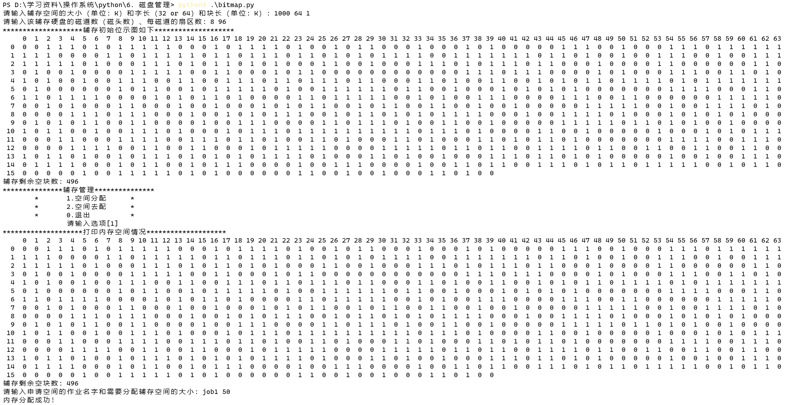

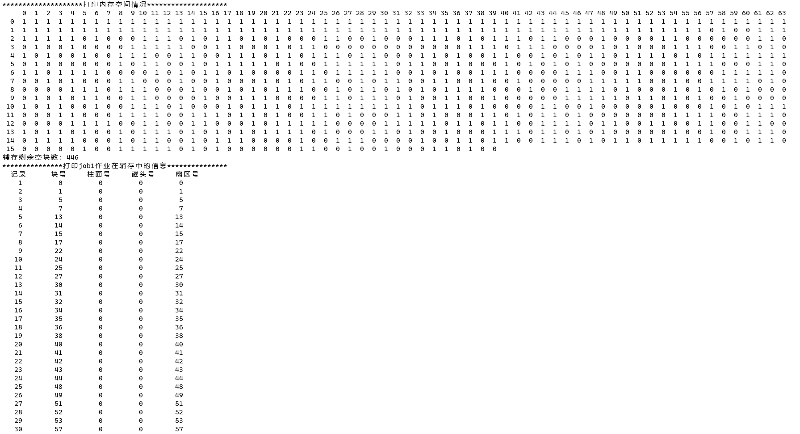

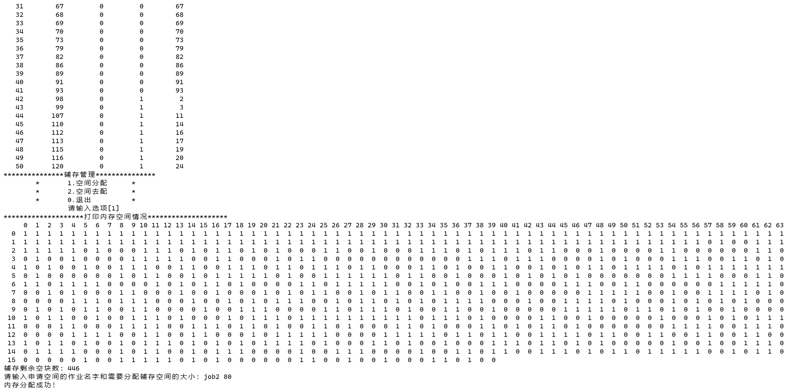

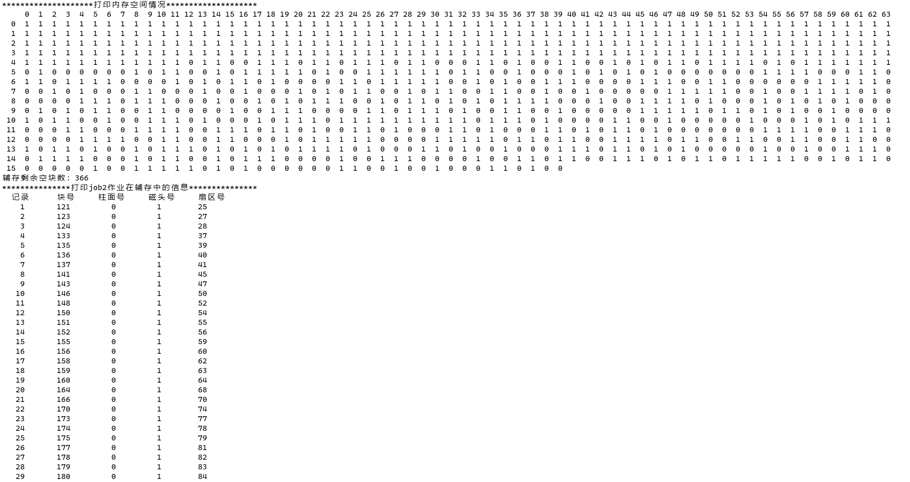


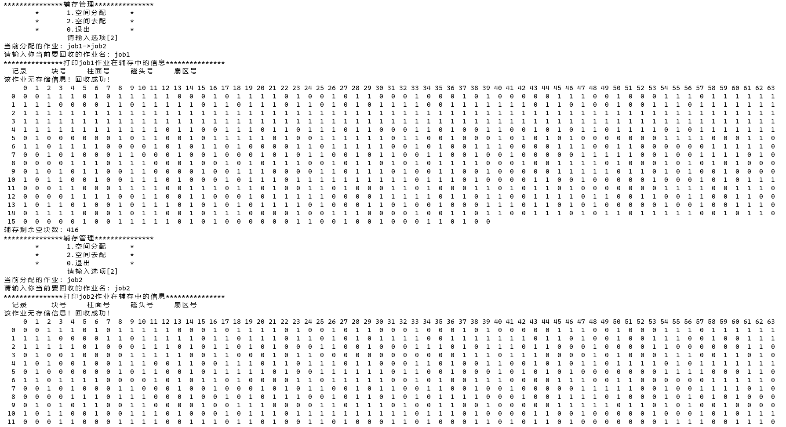

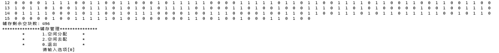

---

## <span id="notice">6. 注意事项</span>

* 本项目源码地址：https://github.com/Yang-Zhongshan/OS-labsource
* 由于时间、技术水平有限，代码难免出现纰漏，如果您发现bug，在该项目地址提交Issue即可

